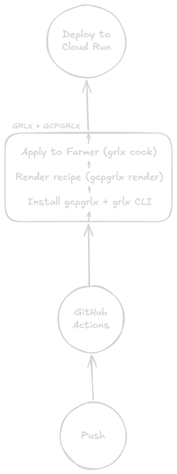
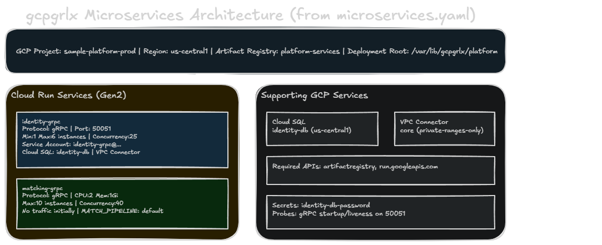

# gcpgrlx

[](https://github.com/djburkhart/gcpgrlx/actions/workflows/codeql.yml)
[](https://github.com/djburkhart/gcpgrlx/blob/main/LICENSE)
[](https://github.com/djburkhart/gcpgrlx/blob/main/go.mod)
[](https://github.com/djburkhart/gcpgrlx/releases)
[](https://goreportcard.com/report/github.com/djburkhart/gcpgrlx)
[](https://pkg.go.dev/github.com/djburkhart/gcpgrlx)

`gcpgrlx` is a GCP-specific companion module for [`grlx`](https://github.com/gogrlx/grlx) that renders deployment recipes for shipping containerized **gRPC and HTTP microservices** to **Google Cloud Run**.

It is designed for teams that want to keep `grlx` as the automation layer while using Google Cloud as the runtime target.

## What it does

- validates a microservice deployment spec
- resolves default Artifact Registry image URLs
- renders a `.grlx` recipe with `cmd.run` states for:
  - enabling required GCP APIs
  - ensuring an Artifact Registry repository exists
  - deploying each service to Cloud Run
- applies gRPC-friendly defaults such as internal ingress, HTTP/2, and tighter concurrency
- supports advanced deployment controls like secrets, probes, rollout traffic, Cloud SQL, and revision settings
- can also render a companion Caddyfile for routing custom domains to Cloud Run services
- patches the deployment-time Caddyfile with live Cloud Run URLs after deploys finish
- exposes the renderer as both a Go package and a small CLI

## How it works together

The diagarm here showcases how *gcpgrlx* works with *grlx* to create configurations that can easily be used in the Google Cloud ecosystem.

<p align="center">
	
</p>

## Configuration Example Diagram

The following showcases what would actually be created if you were to run the `examples\microservices.yaml` through the *gcpgrlx* cli and then the generated *grlx* configuration through the *grlx* cli.

<p align="center">
	
</p>


## Why Cloud Run

Cloud Run is a strong default for microservices because it keeps the deployment contract small:

- each service is a container
- ingress, scaling, CPU, memory, and auth are first-class flags
- it maps cleanly onto generated `grlx` `cmd.run` states

For gRPC services, `gcpgrlx` can emit Cloud Run deploy commands with:

- `--use-http2`
- internal-only ingress by default
- disabled unauthenticated access by default
- service-level concurrency and optional VPC connector settings
- optional startup and liveness probes via `gcloud beta run deploy`

## Install

```powershell
go install .\cmd\gcpgrlx
```

## Example spec

See `examples\microservices.yaml`.

## Render a recipe

```powershell
go run .\cmd\gcpgrlx render -f .\examples\microservices.yaml -out .\dist
```

That writes:

- `dist\deploy.grlx`

## Render a Caddyfile

```powershell
go run .\cmd\gcpgrlx render-caddy -f .\examples\microservices.yaml -out .\dist
```

That writes:

- `dist\caddy\Caddyfile`

Or print the generated Caddyfile directly:

```powershell
go run .\cmd\gcpgrlx render-caddy -f .\examples\microservices.yaml --stdout
```

## Use the generated recipe with grlx

Once your `grlx` CLI is connected to a `farmer` and your target sprout or cohort is registered, you can cook the generated recipe directly.

Preview the recipe without applying changes:

```powershell
grlx cook .\dist\deploy.grlx -T gcp-runner --test
```

Apply the deployment recipe to a target sprout:

```powershell
grlx cook .\dist\deploy.grlx -T gcp-runner
```

Or target a cohort instead of a single sprout:

```powershell
grlx cook .\dist\deploy.grlx -C platform
```

This is the intended workflow: `gcpgrlx` renders the Cloud Run deployment recipe, and `grlx` distributes and executes that recipe against the machines that have `gcloud` and the required Google Cloud credentials.

When `caddy.enabled: true` is set, the generated deploy recipe also includes Caddy lifecycle steps: install Caddy on the target, query each Cloud Run service URL with `gcloud run services describe`, write the final Caddyfile into `deployment_root`, copy it into `/etc/caddy/Caddyfile`, validate it, and reload the Caddy service.

When `smoke_tests` are configured, the generated recipe appends end-to-end verification steps after deploy and Caddy apply work. HTTP smoke tests can target a fixed `url` or a named `service`; service-based tests automatically use the Caddy domain/path when available, otherwise they query the live Cloud Run URL directly.

## Render directly to stdout

```powershell
go run .\cmd\gcpgrlx render-stdout -f .\examples\microservices.yaml
```

## Preview a deployment plan

```powershell
go run .\cmd\gcpgrlx plan -f .\examples\microservices.yaml
```

## Validate a config

```powershell
go run .\cmd\gcpgrlx validate -f .\examples\microservices.yaml
```

## Initialize a starter config

```powershell
go run .\cmd\gcpgrlx init -out .\microservices.yaml
```

To print the starter config instead of writing a file:

```powershell
go run .\cmd\gcpgrlx init --stdout
```

## Example output shape

The generated recipe includes states like:

- verify `gcloud` is installed
- enable `run.googleapis.com` and `artifactregistry.googleapis.com`
- create the Artifact Registry repository if missing
- deploy each microservice with `gcloud run deploy`
- deploy worker and cron jobs with `gcloud run jobs deploy`
- configure gRPC services with end-to-end HTTP/2 support
- install and apply Caddy when `caddy.enabled: true`
- run configured smoke tests at the end of the rollout

## Go package

```go
package main

import (
	"fmt"
	"os"

	"github.com/djburkhart/gcpgrlx"
)

func main() {
	raw, err := os.ReadFile("microservices.yaml")
	if err != nil {
		panic(err)
	}

	cfg, err := gcpgrlx.ParseConfig(raw)
	if err != nil {
		panic(err)
	}

	recipe, err := gcpgrlx.RenderRecipe(cfg)
	if err != nil {
		panic(err)
	}

	fmt.Println(recipe)
}
```

## Spec model

Top-level fields:

- `project_id`
- `region`
- `artifact_registry_repository`
- `deployment_root` (optional)
- `caddy` (optional)
- `required_services` (optional)
- `smoke_tests` (optional)
- `services`

Top-level `caddy` fields:

- `enabled`
- `file` (optional output path, defaults to `Caddyfile`)
- `template` (optional inline `text/template` for advanced Caddyfile rendering)
- `snippets` (optional reusable named Caddy snippet bodies)

Top-level `smoke_tests` fields:

- `name`
- `service` (optional named service target)
- `type` (`http` or `command`)
- `url` (optional explicit URL target)
- `path` (optional request path for HTTP tests)
- `method` (optional HTTP method, defaults to `GET`)
- `headers` (optional request headers)
- `expected_status` (optional, defaults to `200`)
- `body_contains` (optional response substring check)
- `command` (required for `type: command`)
- `timeout` (optional, defaults to `2m`)
- `skip_tls_verify` (optional)

Per-service fields:

- `name`
- `image` (optional; default Artifact Registry URL is generated when omitted)
- `profile` (`service`, `worker`, or `cron`; defaults to `service`)
- `service_account` (optional)
- `protocol` (`http` or `grpc`)
- `command`
- `args`
- `port`
- `cpu`
- `memory`
- `concurrency`
- `min_instances`
- `max_instances`
- `timeout`
- `tasks`
- `parallelism`
- `max_retries`
- `revision_suffix`
- `traffic_percent`
- `no_traffic`
- `cpu_throttling`
- `startup_cpu_boost`
- `execution_environment`
- `use_http2`
- `allow_unauthenticated`
- `ingress`
- `vpc_connector`
- `vpc_egress`
- `cloud_sql_instances`
- `secrets`
- `startup_probe`
- `liveness_probe`
- `env`
- `labels`
- `annotations`
- `caddy`
- `cron`

Per-service `caddy` fields:

- `domain`
- `path` (optional, defaults to `/`)
- `upstream` (optional explicit override)
- `headers` (optional response headers)
- `presets` (optional built-in middleware preset imports)
- `snippets` (optional list of reusable snippet imports)
- `cohorts` (optional alias for additional snippet imports)

Per-service `cron` fields:

- `schedule`
- `time_zone` (optional, defaults to `UTC`)
- `service_account` (optional; defaults to the service `service_account`)
- `job_name` (optional; defaults to `{service-name}-schedule`)

### gRPC defaults

If `protocol: grpc` is set for a service, `gcpgrlx` automatically defaults:

- `ingress: internal`
- `allow_unauthenticated: false`
- `use_http2: true`
- `concurrency: 20`

### Advanced deployment fields

- `secrets` render to `--update-secrets`
- `cloud_sql_instances` render to `--add-cloudsql-instances`
- `traffic_percent` adds a follow-up `gcloud run services update-traffic` step
- `no_traffic: true` keeps a new revision dark after deploy
- `command` and `args` override container startup behavior
- `cpu_throttling`, `startup_cpu_boost`, and `execution_environment` control runtime behavior
- `startup_probe` and `liveness_probe` switch recipe generation to `gcloud beta run deploy`

### Worker and cron profiles

- `profile: service` keeps the current Cloud Run service flow with traffic, ingress, and optional Caddy routing
- `profile: worker` renders a Cloud Run Job deploy for queue consumers and one-off worker processes
- `profile: cron` renders a Cloud Run Job deploy plus a Cloud Scheduler HTTP job that triggers `:run` on a schedule
- cron profiles automatically add `cloudscheduler.googleapis.com` to the required service enablement list
- worker and cron profiles do not support traffic splitting, Caddy routing, or HTTP smoke tests by service name

### Caddy routing fields

If top-level `caddy.enabled: true` is set, any service with a `caddy` block is included in the generated Caddyfile.

- routes are grouped by `domain`
- `path` can split one domain across multiple services
- `domain` is required for every service-level `caddy` block when Caddy generation is enabled
- `upstream` defaults to `https://{service-name}-{region}.a.run.app`
- during deploy recipes, unset upstreams are patched with the live `status.url` returned by Cloud Run after deployment
- deploy recipes can install Caddy with the distro package manager, copy the generated config to `/etc/caddy/Caddyfile`, validate it, and reload the service
- set `upstream` explicitly if you want to pin a custom domain or a known upstream instead of using the live Cloud Run URL
- top-level `snippets` let you define reusable Caddy blocks and each service can import built-in `presets` plus custom `snippets` and `cohorts`
- `template` lets you override the default Caddyfile layout with Go `text/template`
- duplicate `domain` + `path` combinations are rejected during validation

### Caddy middleware presets

Built-in `caddy.presets` names:

- `compression`
- `security-headers`
- `hsts`
- `cors-permissive`
- `no-store`

These render as reusable named imports, so presets and custom snippets can be mixed on the same service.

### Caddy template data

Custom `caddy.template` values receive:

- `.Config` for the parsed `Config`
- `.Domains` for the sorted domains and their routes
- `.Snippets` for named reusable snippet bodies

Available template helpers:

- `indent STRING PREFIX`
- `join SLICE SEP`
- `quote STRING`
- `trim STRING`

### Smoke test fields

- service-based HTTP smoke tests use the Caddy edge route when the referenced service has a `caddy` block
- otherwise they query the live Cloud Run `status.url` before issuing the request
- command smoke tests let you run custom checks like `grpcurl`, schema checks, or multi-step shell probes
- smoke test steps run after deploy, traffic, and Caddy lifecycle steps so they exercise the final routed system

## Validation

```powershell
go test .\...
```

## License

MIT
